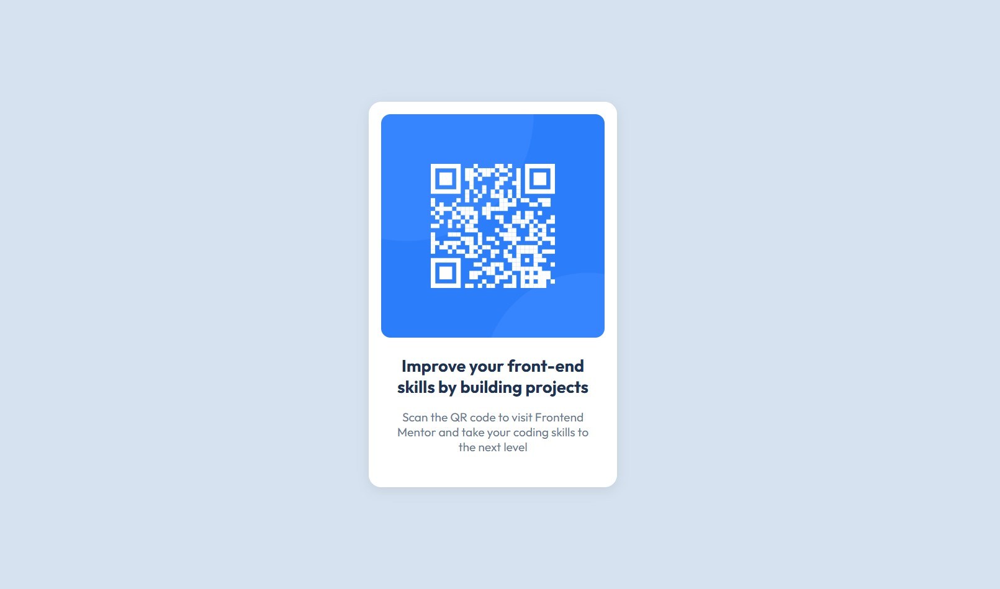

# Frontend Mentor - QR code component solution

This is a solution to the [QR code component challenge on Frontend Mentor](https://www.frontendmentor.io/challenges/qr-code-component-iux_sIO_H). Frontend Mentor challenges help you improve your coding skills by building realistic projects. 

## Table of contents

- [Overview](#overview)
  - [Screenshot](#screenshot)
  - [Links](#links)
- [My process](#my-process)
- [Author](#author)

## Overview

### Screenshot

### Links

- Solution URL: [https://ivaninterfacedeveloper.github.io/QRcodeComponent/](https://ivaninterfacedeveloper.github.io/QRcodeComponent/)
- Live Site URL: [Frontend Mentor - QR code Component](https://www.frontendmentor.io/learning-paths/getting-started-on-frontend-mentor-XJhRWRREZd/steps/68828d9bff16b783841f7e57/challenge/start)

## My process
1. ✅ The project has been initialized as a public repository on GitHub, with a clear folder structure and a well-documented README file.
2. ✅ The repository is configured to publish via GitHub Pages, displaying the live version of the site at a public web address.
3. ✅ Designs were reviewed thoroughly and a CSS. Key classes were mapped out for typography, spacing and a simple layout structure.
4. ✅ The HTML content was structured semantically using clear hierarchy and accessibility.
5. ✅ Base styles have been written, defining font-family, font-size, variables.
6. ✅ Styling Responsive design was implemented.

## Author

- Website - Iván Vargas O.
- Frontend Mentor - [@IvanInterfaceDeveloper](https://www.frontendmentor.io/profile/IvanInterfaceDeveloper)
